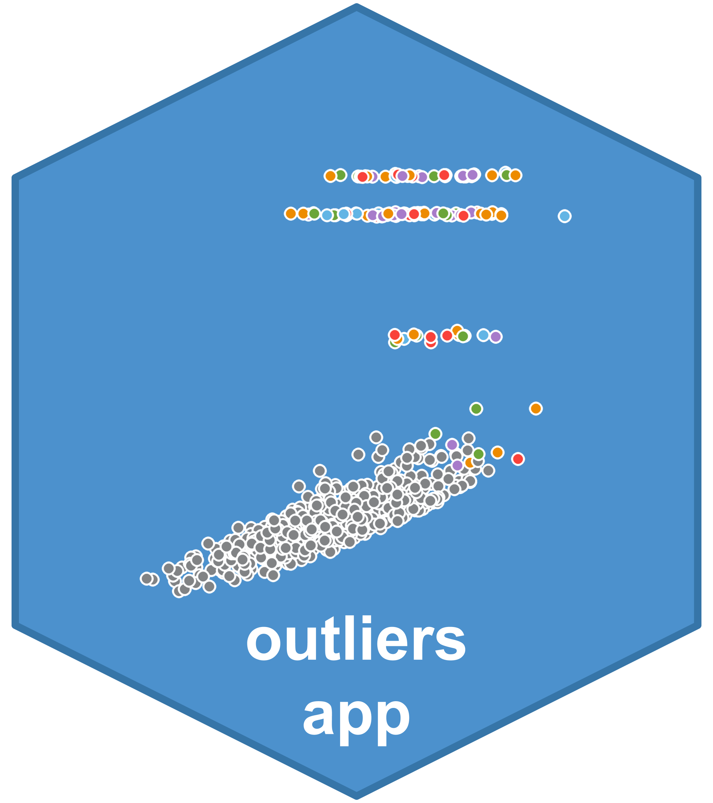

```{r setup, include=FALSE}
knitr::opts_chunk$set(echo = TRUE)
```

# Outliers (Shiny) App 

A Shiny app for the ONDRI outlier detection pipeline which includes key visualization, interactivity, and report generation. 
For more details, see the [OuRS package](https://github.com/derekbeaton/OuRS).

<br>

* Install [R](https://cran.r-project.org/) first and then [RStudio](https://rstudio.com/products/rstudio/download/). Please choose the correct installer carefully as it will depend on your computer's operating system.

<br>

* Install the `GSVD` and `ours` packages (which are not available through CRAN) with the following lines of code:
```
  if (!require("devtools")){
    install.packages("devtools")
  }
  
  if (!require("GSVD")){
    Sys.setenv(R_REMOTES_NO_ERRORS_FROM_WARNINGS = TRUE)
    devtools::install_github("derekbeaton/GSVD")
  }
  if (!require("ours")){
    Sys.setenv(R_REMOTES_NO_ERRORS_FROM_WARNINGS = TRUE)
    devtools::install_github("derekbeaton/OuRS", subdir = "/OuRS")
  }
```

<br>

* Download and install the shiny app directly with the following lines of code:
```
  if (!require("devtools")){
    install.packages("devtools")
  }
  devtools::install_github(repo = "ondri-nibs/outliers_app")
```
If you get the following message in your RStudio console, please type 3.
<br><br>


<br>

* Type ```ONDRIOutliersApp::installPackages()``` to install any missing packages and/or dependencies.
Please type 3 again if you get the message above.

<br>

* When installation is complete, type ```ONDRIOutliersApp::runApp()``` to open the app.